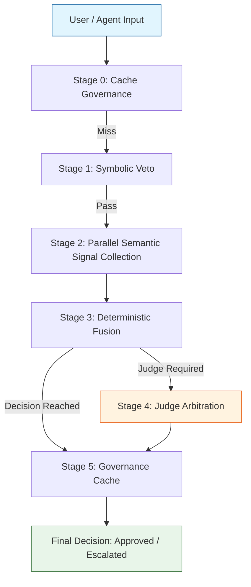

# SentinAL v3 — Deterministic-First AI Governance Architecture

## Problem Statement

Integrating Large Language Models (LLMs) into backend enterprise automation systems and **Agentic AI workflows** introduces critical reliability and execution-control challenges. As agentic pipelines scale in complexity, systems face:

- **Policy Override:** Inputs that arbitrarily force models to abandon system instructions and adopt unconstrained functional paths.
- **Contextual Payload Drift:** Unstructured inputs that manipulate execution contexts, subverting the workflow's intended function.
- **Multi-Step Reasoning Drift:** Autonomous agents deviating from core enterprise guardrails as task complexity scales over multiple reasoning loops.
- **Lack of Deterministic Arbitration:** Purely generative systems offering stochastic compliance, producing unpredictable pipeline outcomes.
- **Escalation Ambiguity:** Workflows failing to reliably determine when a sub-task or generated query requires human-in-the-loop review.

SentinAL v3 addresses these challenges by operating explicitly as a **scalable governance middleware**. It provides a localized control pipeline that strictly arbitrates enterprise policy enforcement and workflow validation through deterministic rules before deferring to stochastic evaluation. To guarantee seamless integration with LLM-integrated backend systems, all arbitration outputs are rigorously enforced in a deterministic, structured JSON format. This architecture ensures that agentic planning and execution loops operate reliably within rigid enterprise policy boundaries.

## Architecture Overview

SentinAL v3 implements a 6-stage sequential evaluation framework, prioritizing deterministic checks for continuous policy enforcement and workflow validation before invoking neural arbitration.



## Governance Philosophy

The architecture is structured around five foundational design principles:

1. **Deterministic-First Arbitration:** Known policy violations are resolved deterministically, reducing unnecessary neural arbitration and improving system predictability.
2. **LLM Judge Invoked Only in Ambiguity:** The system invokes a secondary local LLM adjudicator (running via controlled inference) only under structured ambiguity.
3. **Fail-Closed Design:** Any module failure, policy load error, or pipeline exception automatically defaults to a high-risk escalation.
4. **Externalized Policy Logic:** All symbolic rules and response schemas are strictly separated from core codebase logic, allowing dynamic policy updates without code deployment.
5. **Multi-Layer Signal Fusion:** Decisions synthesize signals across multiple parallel modules (domain, intent, threat context) rather than relying on isolated metrics.

## Evaluation Summary

The system has been empirically validated against a robust multi-category adversarial dataset. The metrics below frame SentinAL v3 as a **precision-first conservative governance** implementation, establishing a baseline with a clear calibration roadmap.

- **Total Prompts Validated:** 280
- **Precision:** 1.0 (100%)
- **Recall:** 0.18 (18.1%)
- **Attack Success Rate (ASR):** 0.81 (81.9%)
- **False Positive Rate (FPR):** 0.0 (0.0%)
- **Judge Invocation Rate:** 36.0%

*Note: The results indicate a deliberately conservative calibration threshold, resulting in perfect precision and zero false positives. Future iterations will focus on calibrated threshold tuning, expanded semantic anchor coverage, and weighted fusion modeling to improve recall while preserving precision guarantees.*

## Layer Contribution Breakdown

The 6-stage architecture guarantees modular firing behavior and independence across evaluation steps:

- **Cache Governance:** Locks historical high-risk decisions, preventing semantic downgrade attacks from identical adversarial repeats.
- **Symbolic Hard Ban:** Deterministically halts explicit jailbreak patterns and high-severity violations.
- **Semantic Signal Collection:** Parallellizes vector similarity checks for prompt intent, out-of-domain drift, and emerging dynamic threats.
- **Deterministic Fusion:** Weighs the aggregated signals to generate a preliminary verdict, invoking the LLM Judge solely when signals conflict or fall within ambiguous thresholds.
- **Judge Arbitration:** Resolves nuanced or heavily contextual prompts through a specialized local semantic adjudication model.
- **Governance Caching:** Commits final arbitration metadata back to the high-speed cache.

This layered structure ensures each mechanism fires independently and serves a specific empirical purpose in continuous policy enforcement and workflow validation.

## Enterprise Workflow Integration

SentinAL v3 is designed as an **agentic workflow control middleware**, inserting itself seamlessly between reasoning systems and their backend execution environments. This deterministic design is highly applicable to rigorous enterprise domains such as financial planning, forecasting, and decision-support pipelines (FP&A), where automated workflows must adhere to strict financial policy constraints and deliver predictable outputs:

```text
[Planner Agent] ──(Instruction)──> [SentinAL Arbitration]
                                           │
                                    (Approved / Escalated)
                                           │
[Execution Agent] <──(Delegation)──────────┘
```

By functioning at this interception point, SentinAL functions as a deterministic governance layer, validating sub-tasks and system prompts before downstream LLMs operationalize them.

## System Design Considerations

- **Modular Architecture:** Core enforcement logic is entirely decoupled from externalized JSON policy schemas, enabling dynamic configuration without codebase modification.
- **Stage Isolation:** A 6-stage pipeline guarantees that fast, deterministic mechanisms fire independently of heavier neural arbitration steps.
- **Deterministic-First Arbitration:** Resolves edge cases through O(1) symbolic rules and strict JSON output schemas, reducing reliance on latency-heavy stochastic models.
- **Scalable Middleware Design:** Operates as a localized, stateless evaluation layer perfectly suited for insertion into complex LLM-integrated backend architectures.

## Integration with RAG-Based Systems

SentinAL can be deployed downstream of Retrieval-Augmented Generation (RAG) pipelines to validate structured responses before they are committed to enterprise systems.

In an FP&A context, this enables:

- Validation of financial explanations generated from retrieved knowledge
- Enforcement of role-based execution constraints on analysis outputs
- Escalation of ambiguous variance interpretations
- Deterministic, API-safe JSON response enforcement prior to backend persistence

This modular integration allows RAG systems and agentic workflows to operate within predictable enterprise guardrails without tightly coupling knowledge retrieval and governance logic.

## Known Limitations

- **Conservative Thresholds Reduce Recall:** The current zero-tolerance precision configuration necessarily limits adversarial recall on novel or deeply obfuscated attacks.
- **Semantic Generalization Requires Expansion:** Current embedding-based semantic detection requires expanded anchor coverage to capture deeply embedded narrative injections.
- **Calibration Tradeoffs Exist:** Tightening the latency-heavy LLM Judge thresholds impacts system-level throughput, necessitating careful tuning based on operational criticality.

## v4 Roadmap

Subsequent development will build directly upon this deterministic framework rather than fundamentally altering it, focusing on:

- **Adaptive Threshold Tuning:** Introducing dynamically adjusting confidence thresholds relative to the active deployment environment.
- **Weighted Fusion Modeling:** Shifting the static rule arbitration into a more continuous, weighted regression between the parallel signal layers.
- **Broader Semantic Anchors:** Expanding the vocabulary and scale of the vectorized attack-intent policies (meta_intent_anchors).
- **Cross-Layer Correlation Optimization:** Investigating temporal signals where multiple borderline attacks point to a prolonged probing strategy.
